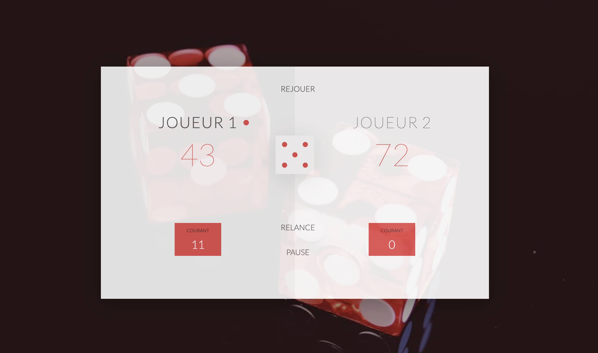

# Description

This project using html, css and javascript to get a gaming js.

# ScreenShot



# Demo

To get the demo click of the website click here : [GAMINGJS](https://azedine-batouche.github.io/game-pig/) .

# Setup

first clone the project in your workspace with this command line

```
git clone https://github.com/batouche-dev/game-pig.git
```

# Launch

```
cd game-pig
```

and then open index.html file with any browser: chrome, firefox, safari ...
